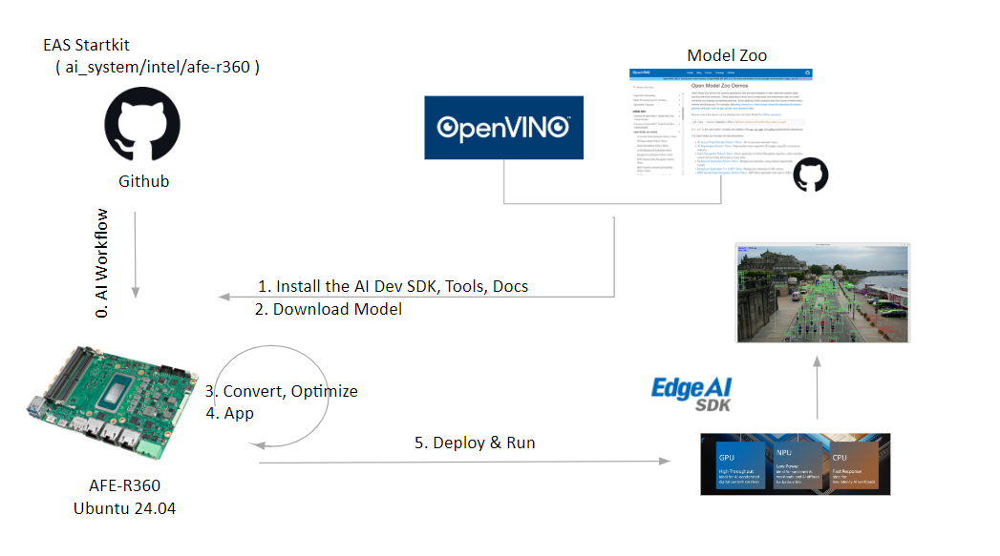

# Create an Object Detection on AFE-R360 ( Intel / 14th Meteor Lake )
This example will demonstrate how to develop an vision AI Object Detection on AFE-R360 ( Intel 14th Meteor Lake ) platform.
Developers can easily complete the Visual AI development by following these steps.



- [Environment](#Environment)
  - [Target](#Target)
  - [Develop](#Develop) 
- [Develop Flow](#DevelopFlow)
  - [Download & Convert](#DownloadModel) 
- [Deploy](#Deploy)
  - [Application](#Application)

<a name="Environment"/>

# Environment
Refer to the following requirements to prepare the target and develop environment.

<a name="Target"/>

## Target
| Item | Content | Note |
| -------- | -------- | -------- |
| Platform / RAM / Disk |   Intel(R) CoreTM Ultra 7 165U / 32G / 256G  |      |
| SOC | CPU、iGPU、NPU | |
| Accelerator | Intel(R) AI Boost (NPU) | NPU Driver 1.5.1 |
| OS/Kernel | * Ubuntu 24.04 (LTS) / 6.8.0 |  |
| OpenVINO | 2024.3.0 (LTS) | |

Base on EdgeAI SDK 3.1.0

<a name="Develop"/>

## Develop
### OpenCV 4.7.0
- OpenCV source
 https://github.com/opencv/opencv.git
- How to install, setup
1. Clone on your device and check out to tag 4.7.0 .

```
git clone https://github.com/opencv/opencv.git
git checkout 725e440
```


2. Following the steps below.

- Install the dependency for OpenCV :
```
sudo apt update

sudo apt install build-essential cmake git pkg-config libgtk-3-dev \
    libavcodec-dev libavformat-dev libswscale-dev libv4l-dev \
    libxvidcore-dev libx264-dev libjpeg-dev libpng-dev libtiff-dev \
    gfortran openexr libatlas-base-dev python3-dev python3-numpy \
    libtbb2 libtbb-dev libopenexr-dev \
    libgstreamer-plugins-base1.0-dev libgstreamer1.0-dev

sudo apt install ffmpeg libavformat-dev libavcodec-dev libswscale-dev
```
- make a file in where you clone
```
cd opencv
mkdir build_470
cd build_470
```
- Install
```
cmake -D CMAKE_BUILD_TYPE=RELEASE -D WITH_FFMPEG=ON -D CMAKE_INSTALL_PREFIX=/usr/local -D OPENCV_GENERATE_PKGCONFIG=ON ..

make -j8

```

### Application Binary
- open model zoo
https://github.com/openvinotoolkit/open_model_zoo/tree/releases/2024/3
- How to install, setup

Clone on your device and check out to tag "releases/2024/3" .
```
git clone https://github.com/openvinotoolkit/open_model_zoo.git
git checkout 9c6d95a
cd open_model_zoo
git submodule init
git submodule update
```


- Following the steps below.

**Before you run build_demos, you must export to the *build_470* folder you previously created.**
```
source "/opt/intel/openvino_2024/setupvars.sh"
```
```
export OpenCV_DIR=<path>/build_470
```
```
cd open_model_zoo/demos
./build_demos.sh
```
### model tool

omz_downloader
https://github.com/openvinotoolkit/open_model_zoo/blob/releases/2024/3/tools/model_tools/README.md

<a name="DevelopFlow"/>

# Develop Flow
Follow these steps to get and optimize the VisionAI model for target AI device. <br>

<a name="DownloadModel"/>

## Download & Covert Model

### Objection Detection (YOLO v3)

- open model zoo: https://github.com/openvinotoolkit/open_model_zoo/tree/releases/2024/3/models/public/yolo-v3-tf

- Download & Covert
Clone open model zoo to your device, then download and covert the model following the steps in the link.
```
omz_downloader --name yolo-v3-tf
```
```
omz_converter --name yolo-v3-tf
```


<a name="Deploy"/>

# Deploy
Copy the optimized AI model to target device and  launch an AI application with gstream pipeline.

<a name="Application"/>

## Run Application
### Objection Detection (object_detection_demo)
- Follow the steps in the link
https://github.com/openvinotoolkit/open_model_zoo/tree/releases/2024/3/demos/object_detection_demo/cpp


- Example
```
cd /$HOME/omz_demos_build/intel64/Release
```
```
source "/opt/intel/openvino_2024/setupvars.sh"
./object_detection_demo -m <path_to_model>/yolo-v3-tf.xml -d CPU -i <path_to_video>/TestVideo.mp4 -at yolo -loop
```

Result:


