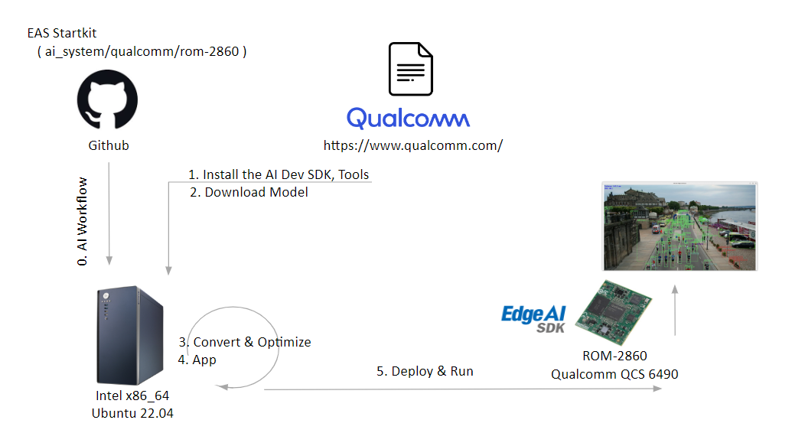

# Create an Object Detection on ROM-2860 ( Qualcomm/QCS6490 )
This example will demonstrate how to develop an vision AI Object Detection on ROM-2860 ( Qualcomm QCS6490 ) platform.
Developers can easily complete the Visual AI development by following these steps.

* Application: Objection Detection
* Model: Yolov5
* Input: Video / USB Camera

# Table of Contents
- [Environment](#Environment)
  - [Target](#Target)
  - [Develop](#Develop) 
- [Develop Flow](#DevelopFlow)
  - [Download Model](#DownloadModel)
  - [Convert & Optimize](#Convert_Optimize)  
- [Deploy](#Deploy)
  - [Application](#Application)

<a name="Environment"/>

# Environment
Refer to the following requirements to prepare the target and develop environment.

<a name="Target"/>

## Target
System requirements
| Item | Content | Note |
| -------- | -------- | -------- |
| Platform | ROM-2860 | Qualcomm QCS6490|
| CPU      | Arm64 Cortex-A55 |
| Accelerator | DSP | |
| OS/Kernel | ubuntu 20.04 / 5.4.233 | * SNPE (runtime)  * Gstreamer   |
| Image | QCS6490.UBUN.1.0 | QCS6490.UBUN.1.0-00011-STD.PROD-1 |

AI Inference Framework

| AI Frameworks | Version | Description | 
| -------- | -------- | -------- | 
| SNPE     | v2.20.0.240223    | The Qualcomm® Neural Processing SDK is a Qualcomm Snapdragon software accelerated runtime for the execution of deep neural networks. With Qualcomm® Neural Processing SDK :   * Execute an arbitrarily deep neural network   * Execute the network on the Snapdragon CPU, the Adreno GPU or the Hexagon DSP.   * Debug the network execution on x86 Ubuntu Linux    * Convert PyTorch, TFLite, ONNX, and TensorFlow models to a Qualcomm® Neural Processing SDK Deep Learning Container (DLC) file    * Quantize DLC files to 8 or 16 bit fixed point for running on the Hexagon DSP    * Debug and analyze the performance of the network with Qualcomm® Neural Processing SDK tools    * Integrate a network into applications and other code via C++ or Java |
| Gstreamer     |  1.16.3   | GStreamer is a library for constructing graphs of media-handling components. The applications it supports range from simple Ogg/Vorbis playback, audio/video streaming to complex audio (mixing) and video (non-linear editing) processing. |

<a name="Develop"/>

## Develop
System requirements
| Item | Content | Note |
| -------- | -------- | -------- |
| Platform | Intel 12 or 13th CPU   |      |
| OS/Kernel | Ubuntu 20.04 | * Python 3.8 |

AI Development SDK 
| Item | Introduction |  Install |
| -------- | -------- | -------- |
|   SNPE   |  Qualcomm Snapdragon software accelerated runtime for the execution of deep neural networks (for inference) with SNPE, users can:Convert Caffe, Caffe2, TensorFlow, PyTorch and TFLite models to a SNPE deep learning container (DLC) fileQuantize DLC files to 8bit/16bit fixed point for execution on the Qualcomm® Hexagon™ DSP/HVX HTA Integrate a network into applications and other code via C++ or Java Execute the network on the Snapdragon CPU, the Qualcomm® AdrenoTM GPU, or the Hexagon DSP with HVX* and HMX* support, Execute an arbitrarily deep neural network Debug the network model execution on x86 Ubuntu Linux Debug and analyze the performance of the network model with SNPE tools Benchmark a network model for different targets  |     

How to intsll the SNPE ( on x86_x64 host machine )
1. Sign Up Qualcomm Account My Account (qualcomm.com): https://myaccount.qualcomm.com/signup

2. Install Qualcomm Package Manager 3: https://qpm.qualcomm.com/#/main/tools/details/QPM3

3. Install Qualcomm® AI Engine Direct SDK: https://qpm.qualcomm.com/#/main/tools/details/qualcomm_ai_engine_direct

4. Install Qualcomm® Neural Processing SDK: https://qpm.qualcomm.com/#/main/tools/details/qualcomm_neural_processing_sdk

5. Install ML frameworks:
    pip install onnx==1.11.0
    pip install tensorflow==2.10.1
    pip install torch==1.13.1"

<a name="DevelopFlow"/>

# Develop Flow
Follow these steps to get and optimize the VisionAI model for target AI device.  
'Table 3-45 Element properties for qtimlvdetection' Refer to the document [Document](https://docs.qualcomm.com/bundle/publicresource/80-88500-50_REV_AA_QRB5165_LU_2_0_QUALCOMM_INTELLIGENT_MULTIMEDIA_SDK__IM_SDK__Reference.pdf)
  

<a name="DownloadModel"/>

## Download Model
Device: Develop platform
- 1. Download Model (pt) 
     [yolov5n.pt](https://github.com/ultralytics/yolov5/releases/download/v7.0/yolov5n.pt)
     refer to https://github.com/ultralytics/yolov5
     
<a name="Convert_Optimize"/>

## Convert & Optimize
Device: Develop platform
- 2. Convert (pt -> onnx) 
     refer to `export.py` within https://github.com/ultralytics/yolov5 

- 3. Convert & Optimize (onnx -> dlc), Refer to document below: 
      [Reference Document Link](https://docs.qualcomm.com/bundle/publicresource/KBA-240222225148_REV_1_Quick_Start_Demo_of_SNPE_Yolov5_in_6490.pdf)
 
<a name="Deploy"/>

# Deploy
Copy the optimized AI model to target device and  launch an AI application with gstream pipeline.

<a name="Application"/>

## Application
Device: Target platform
Refer to '3.23 qtimlvdetection -> Example :  High- and low-resolution Camera streams with Object Detection using
Video Overlay and displayed on screen' in [Reference Document](https://docs.qualcomm.com/bundle/publicresource/80-88500-50_REV_AA_QRB5165_LU_2_0_QUALCOMM_INTELLIGENT_MULTIMEDIA_SDK__IM_SDK__Reference.pdf)
  
| App  | Command  | Remark  |
| -------- | -------- | ------------- |
| Run on dsp (usb camera) |   gst-launch-1.0 -e qtivcomposer name=mixer sink_1::dimensions="<1920,1080>" ! queue ! waylandsink sync=true fullscreen=false x=10 y=10 width=1280 height=720 v4l2src device="/dev/video0"  ! tee name=t ! queue ! mixer. t. ! queue ! qtimlvconverter mean="<0.0, 0.0, 0.0>" sigma="<0.003921, 0.003921, 0.003921>" ! queue ! qtimlsnpe delegate=dsp model="yolov5n-quant.dlc" layers="< Conv_266, Conv_232, Conv_198 >" ! queue ! qtimlvdetection threshold=51.0 results=10 module=yolov5 labels="yolov5.labels" ! video/x-raw,width=480,height=270 ! queue ! mixer. |  |
| Run on dsp (video file) | gst-launch-1.0 -e qtivcomposer name=mixer sink_1::dimensions="<1920,1080>" ! queue ! waylandsink sync=true fullscreen=false x=10 y=10 width=1280 height=720 filesrc  location="$inputfile" ! qtdemux ! queue ! h264parse ! qtivdec ! queue ! tee name=t ! queue ! mixer.  t. ! queue ! qtimlvconverter mean="<0.0, 0.0, 0.0>" sigma="<0.003921, 0.003921, 0.003921>" ! queue ! qtimlsnpe delegate=dsp model="yolov5n-quant.dlc" layers="< Conv_266, Conv_232, Conv_198 >" ! queue !  qtimlvdetection threshold=51.0 results=10 module=yolov5 labels="yolov5.labels" ! video/x-raw,width=480,height=270 ! queue ! mixer. |  |

# Benchmark
Device: Target platform
| App   | Command  | Remark  |
| -------- | -------- | ------------- |
| Run on dsp | snpe-throughput-net-run --duration 5 --perf_profile burst --use_dsp --userbuffer_auto --container mobilenet_v1_ssd_2017_quantized.dlc | |
 
 

  
